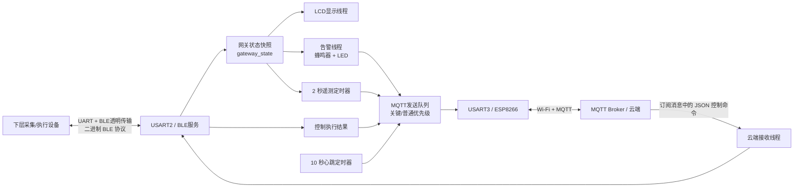
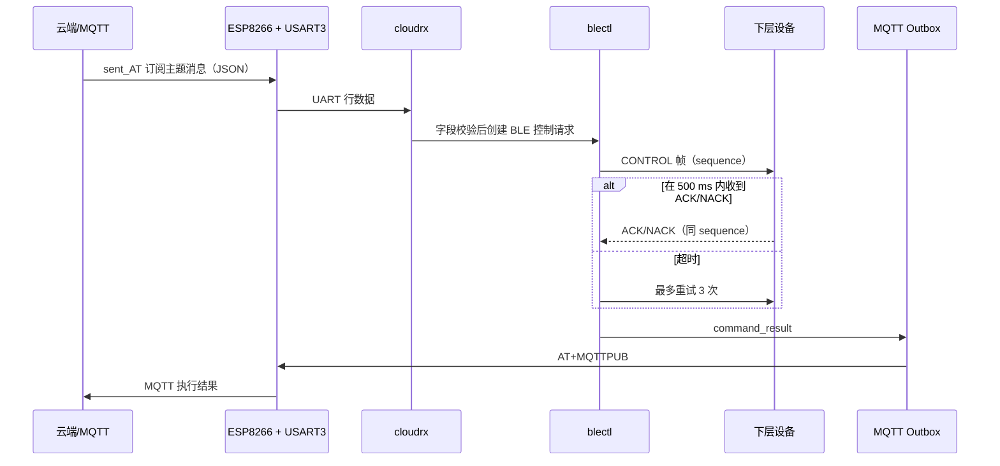
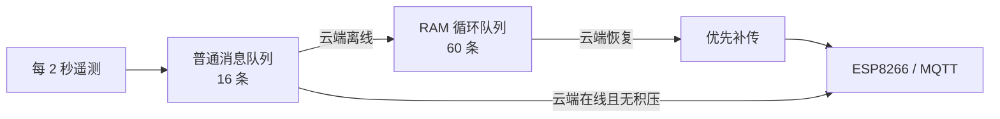

# 生鲜品储运系统工程逻辑框架说明

## 1. 文档目的与结论

本工程是运行在 **STM32F407ZG** 上的嵌入式网关固件。它使用 **RT-Thread 3.1.5** 作为实时内核，并以两条 UART 链路连接外部系统：

- **USART2（PA2/PA3，115200）**：连接下层采集/执行设备的 BLE 透明传输模块。
- **USART3（PA8/PA9，115200）**：连接 ESP8266，使用 AT 指令接入 Wi-Fi 与 MQTT Broker。

当前主链路的设计为：下层设备通过 BLE 帧上报温度、光照、电池与告警；网关缓存为一致性状态快照，定时发布 MQTT 遥测和心跳；云端下发 JSON 控制命令，经网关转换为 BLE 控制帧并等待 ACK/NACK，随后把执行结果回传 MQTT。LCD、蜂鸣器和 LED 为本地可视化/告警输出。

> 工程已完成首轮精简：与当前网关主业务无关的传感器、EEPROM、按键、电机、RTC、传统 I²C/定时器/PWM 和旧队列驱动均已移除。文档以下内容以精简后的可编译工程为准。

## 2. 工程组成与构建入口

| 项目区域 | 责任 | 说明 |
|---|---|---|
| `USER/` | 工程入口、启动与 RT-Thread 板级适配 | `main.c` 是业务入口；`Template.uvprojx` 是 Keil MDK 工程。 |
| `USER/RTE/RTOS/` | RT-Thread 配置与板级初始化 | `rtconfig.h` 配置内核；`board.c` 初始化 SysTick、堆、串口控制台。 |
| `HARDWARE/TASK/` | 业务编排 | 创建服务、线程、定时器，负责显示、告警和上报。 |
| `HARDWARE/blue/` | 网关通信核心 | BLE 帧、BLE 服务、状态快照、云端命令解析、MQTT 发送队列、UART 驱动。 |
| `HARDWARE/esp8266/` | Wi-Fi/MQTT 启动配置 | 向 ESP8266 发送 AT 指令，连接并订阅主题。 |
| `HARDWARE/` | 外设与业务驱动 | LCD、蜂鸣器、LED、BLE/UART、ESP8266 与任务编排。 |
| `components/finsh/` | RT-Thread FinSH/MSH 命令行 | 串口控制台支持。 |
| `CORE/`、`FWLIB/`、`SYSTEM/` | 启动文件、ST 标准外设库、基础宏/延时 | 基础平台层，不包含具体业务。 |
| `OBJ/` | Keil 编译产物 | `.axf`、`.hex`、`.o` 等，不应作为业务源码修改。 |

构建目标由 [`USER/Template.uvprojx`](USER/Template.uvprojx) 定义：芯片为 STM32F407ZG（Cortex-M4F），Flash 1 MB，SRAM 128 KB，预处理宏为 `STM32F40_41xxx, USE_STDPERIPH_DRIVER`。工程目标名目前仍为 `Template`，这是历史模板命名，不影响实际业务代码。

## 3. 整体架构



系统中的 STM32 充当**协议适配与边缘告警网关**，而非直接控制下层执行器：云端命令在网关进行字段校验和路由，真正的模式、风机、空调、LED 亮度、阈值和时间控制由下层设备执行。

## 4. 启动过程

### 4.1 从复位到 RT-Thread

1. `CORE/startup_stm32f40_41xxx.s` 完成向量表与运行时初始化，随后调用 `main()`。
2. `USER/RTE/RTOS/board.c` 中的 `rt_hw_board_init()`：设置中断优先级分组、更新系统时钟、配置 SysTick 为 1 kHz RT-Thread 时钟节拍、初始化组件与 30 KB RT-Thread 动态堆。
3. `uart_init()` 通过 `INIT_BOARD_EXPORT` 初始化 USART1 和 USART3；USART1 作为 FinSH/MSH 控制台，USART3 也是 ESP8266 通信端口。
4. RT-Thread 运行用户 `main()`。

### 4.2 `main()` 的硬件初始化

[`USER/main.c`](USER/main.c) 按以下顺序初始化：

1. LCD；
2. 蜂鸣器、板载 LED、BLE 唤醒脚（PG13）；
3. USART2（BLE，115200）；
4. `TaskInit()`，启动业务服务。

`main()` 返回后，RT-Thread 的主线程结束；长期业务依靠后续创建的线程和定时器运行。

### 4.3 `TaskInit()` 的服务启动顺序

[`HARDWARE/TASK/Task.c`](HARDWARE/TASK/Task.c) 的 `TaskInit()` 是业务调度中心：

1. 清零 `gateway_state`；
2. 创建 MQTT 发送队列与发送线程；
3. 创建 BLE 接收、BLE 控制发送线程及同步对象；
4. 注册 BLE 控制执行结果回调；
5. 同步执行 ESP8266 Wi-Fi/MQTT 配置（最多重试 3 次）；
6. 创建云端接收线程；
7. 创建 LCD 显示线程和告警线程；
8. 启动 2 秒遥测定时器与 10 秒心跳定时器。

注意：ESP8266 配网在 `TaskInit()` 内同步等待，最坏情况下会先阻塞一段时间；Wi-Fi 连接失败时，业务线程仍会创建，但云端发送队列会等待在线状态。

## 5. RT-Thread 并发模型

| 执行实体 | 优先级 / 栈 | 触发方式 | 主要职责 |
|---|---:|---|---|
| `blerx` | 5 / 768 B | USART2 接收中断释放信号量 | 从 BLE 环形缓冲取字节、组帧、更新状态、处理 ACK/NACK。 |
| `blectl` | 6 / 768 B | BLE 控制消息队列 | 编码控制帧、发送、每次等 500 ms ACK，最多 3 次。 |
| `cloudrx` | 7 / 1024 B | USART3 接收中断释放信号量 | 按行接收 ESP8266 输出，维护云端连接状态，解析 JSON 命令。 |
| `mqtttx` | 7 / 768 B | 两个 MQTT 消息队列 | 仅在云端在线时发送，优先发送关键事件。 |
| `alarm` | 10 / 768 B | 100 ms 轮询 | 控制蜂鸣器/LED；检测告警变化及 BLE 失联。 |
| `display` | 12 / 1024 B | 500 ms 轮询 | 刷新 LCD 的连接、遥测和告警信息。 |
| FinSH/MSH | 默认 21 | 串口控制台 | 调试命令行，优先级低于主业务线程。 |
| `telemetry` 定时器 | 周期 2 s | RT-Thread 定时器 | 发布最新遥测快照。 |
| `heartbeat` 定时器 | 周期 10 s | RT-Thread 定时器 | 发布网关/BLE 在线状态。 |

优先级数字越小优先级越高。BLE 数据处理优先于云端解析、上报、显示与告警呈现，符合“先接收与控制、后展示”的设计。

## 6. 数据上行：下层设备到云端

### 6.1 中断到帧解析

1. `USART2_IRQHandler()` 将每个接收字节放入 512 B BLE 环形缓冲区，并释放 `blerx` 信号量。
2. `blerx` 线程逐字节调用 `ble_frame_parser_feed()`。
3. 帧解析器校验固定帧头、版本、最大载荷（128 B）和 CRC16-Modbus；非法帧会丢弃并重新寻帧。
4. 对合法遥测帧调用 `gateway_state_update_telemetry()`，对告警帧调用 `gateway_state_update_alarm()`。

### 6.2 状态快照

`gateway_state` 是网关中唯一的下层数据共享模型：

| 字段 | 来源 | 业务含义 |
|---|---|---|
| `tin_c` / `tout_c` | BLE 遥测帧 | 内/外温度，协议原始值除以 100。 |
| `illuminance_lux` | BLE 遥测帧 | 光照，协议原始值除以 10。 |
| `battery_mv` | BLE 遥测帧 | 电池毫伏值。 |
| `device_status` | BLE 遥测帧 | 下层设备状态字节。 |
| `alarm_code` | BLE 告警帧 | 下层设备告警码。 |
| `telemetry_valid` | 首次有效遥测后置位 | 避免未获取数据时发布遥测。 |

读写快照时短暂关闭中断，保证跨线程读取到的字段一致；快照本身不保留历史曲线、时间戳或持久化记录。

### 6.3 MQTT 上报

`telemetry_timer_callback()` 每 2 秒读取快照，并在 `telemetry_valid=1` 时入普通队列：

```json
{"device_id":"202102","Tin":12.34,"Tout":20.00,"LXin":200.0,"battery_mv":3700,"status":1,"ble_online":1}
```

发布主题为 `sensor_data`。心跳主题为 `heartbeat`，负载包含 `device_id` 和 `ble_online`。告警变化或 BLE 失联时以关键优先级发布到 `fault` 主题。

## 7. 云端控制闭环



### 7.1 云端入站命令

ESP8266 连接后订阅主题 `sent_AT`。`cloud_service.c` 不依赖完整 JSON 库，而是对单行文本进行轻量字段查找，并做以下映射：

| JSON 字段 | 允许值 | BLE 控制 ID | 下层含义 |
|---|---:|---:|---|
| `mode` | `"open"` / `"close"` | `0x01` | 模式开/关（分别转为 1/0）。 |
| `SpeedM1` | 0–100 | `0x02` | 风机速度。 |
| `SpeedM2` | 0–100 | `0x03` | 空调速度。 |
| `SpeedM3` | 0–100 | `0x04` | LED 亮度。 |
| `TinDH` | 浮点数 | `0x05` | 内温上限，乘 100 后传输。 |
| `TinDL` | 浮点数 | `0x06` | 内温下限，乘 100 后传输。 |
| `TG` | 浮点数 | `0x07` | 温差，乘 100 后传输。 |
| `LXD` | 0–200000 | `0x08` | 光照阈值。 |

只有数值合法的字段会被转发；一行内可以同时携带多个控制字段，系统会生成多条独立的 BLE 控制请求。

### 7.2 BLE 控制可靠性

- 每个请求分配递增 `sequence`；在临界区内分配，避免并发冲突。
- 请求队列深度为 8；BLE 离线或队列满时立即产生失败结果。
- 单个请求等待 ACK/NACK 500 ms，最多发送 3 次。
- ACK 的负载应为 `[0x20, 0x00]`；NACK 或非零结果均视为拒绝。
- 最终结果发布主题 `command_result`，负载包括 `device_id`、序列号、命令名、结果码与尝试次数。

结果码：`0=成功`、`1=下层拒绝`、`2=超时`、`3=网关队列满`、`4=BLE 离线`。

## 8. BLE 二进制协议

协议实现位于 [`HARDWARE/blue/ble_frame.c`](HARDWARE/blue/ble_frame.c)，规范见 [`HARDWARE/blue/DEVICE_BLE_PROTOCOL.md`](HARDWARE/blue/DEVICE_BLE_PROTOCOL.md)。帧采用小端序：

```text
AA 55 | version(1) | type(1) | sequence(2) | payload_length(2) | payload(N) | CRC16(2)
```

- 当前版本：`0x01`；最大载荷：128 B。
- CRC：CRC16-Modbus，初值 `0xFFFF`，多项式 `0xA001`；覆盖 `version` 至 `payload`。
- 主要消息：`0x01` 心跳、`0x10` 遥测、`0x11` 告警、`0x20` 控制、`0x7E` ACK、`0x7F` NACK。

遥测帧 `0x10` 的 11 B 负载为：`tin_x100:int16`、`tout_x100:int16`、`lux_x10:uint32`、`battery_mv:uint16`、`device_status:uint8`。

下层设备需要按本节协议自行实现帧收发、控制执行和重复控制帧幂等处理：相同 `sequence` 的重试应只重发原 ACK/NACK，不能重复驱动执行器。

## 9. 云端与 ESP8266 配置

[`HARDWARE/esp8266/wifista.c`](HARDWARE/esp8266/wifista.c) 当前以 AT 指令执行以下流程：复位、关闭回显、Station 模式、连接 Wi-Fi、`AT+MQTTUSERCFG`、`AT+MQTTCONN`、订阅 `sent_AT`。本地参数保存在被 Git 忽略的 `wifi_config.h`，仓库只提交无敏感信息的 `wifi_config.example.h`。

MQTT 上行采用 `AT+MQTTPUB=0,"主题","JSON",0,0`。`mqtt_outbox` 按优先级分为：

- 关键队列：深度 8，用于故障及命令结果；
- 普通队列：深度 16，用于周期遥测和心跳；
- 断线遥测缓存：深度 60 的静态 RAM 循环队列；
- 关键队列始终优先于离线补传和普通实时消息；队列满时丢弃并累计对应丢弃计数。

### 9.1 联网状态判定与自动重连

网关不通过 MQTT 应答确认每一条上行消息；它以 ESP8266 经 USART3 输出的连接状态文本作为网络状态依据：

| ESP8266 串口输出 | 网关处理 | 结果 |
|---|---|---|
| `MQTTCONNECTED` 或 `MQTT CONNECTED` | 设置 `cloud_online=1` | MQTT 发送线程允许上报与补传。 |
| `MQTTDISCONNECTED` 或 `WIFI DISCONNECT` | 设置 `cloud_online=0` | 停止向 ESP8266 发 MQTT 发布命令，普通遥测转入离线缓存。 |

当 `cloud_online=0` 时，`cloudrx` 线程以 **5 秒** 为周期调用 `atk_8266_wifista_config()`。一次重连尝试最多执行 3 轮以下 AT 指令序列：

```text
AT+RST → ATE0 → AT+CWMODE=1 → AT+CWJAP
       → AT+MQTTUSERCFG → AT+MQTTCONN → AT+MQTTSUB("sent_AT")
```

全部步骤成功后置 `cloud_online=1`。重连期间由 `cloudrx` 线程处理 UART3 接收数据，避免 AT 响应与云端命令解析并发读取同一接收环形缓冲。

> 当前断线检测依赖 ESP8266 主动输出断线文本。若模块、路由器或网络链路进入“静默异常”而没有对应串口提示，网关不会立即进入重连。产品部署时建议在云端设置心跳超时告警；如需更强的本地检测，可后续加入定期 `AT+CWJAP?` / MQTT 状态查询或发布确认机制。

### 9.2 断线遥测缓存与补传

断线期间，周期遥测仍按 2 秒产生。MQTT 发送线程会从普通队列取出这些遥测快照，转存到静态 RAM 循环队列，而不写入 EEPROM。



| 项目 | 当前产品行为 |
|---|---|
| 缓存对象 | 仅周期遥测；故障与命令结果留在关键 RAM 消息队列中等待发送。 |
| 容量 | 60 条，由 `MQTT_OFFLINE_TELEMETRY_CAPACITY` 配置。 |
| 理论覆盖时长 | 按 2 秒/条约 120 秒；实际时长会受普通队列已积压消息影响。 |
| 满队列策略 | 保留先进入缓存的较早记录，新增遥测丢弃；`Drop` 计数加一。 |
| 恢复顺序 | 关键消息 → 离线遥测（FIFO）→ 新的普通消息。 |
| 断电/复位 | RAM 清空，未补传数据丢失。 |
| MQTT 发送确认 | 向 ESP8266 UART 写出 AT 发布命令后即从本地缓存删除，不等待 Broker 业务确认。 |

补传的 `sensor_data` JSON 会额外携带以下字段：

```json
{
  "offline": 1,
  "offline_age_ms": 45000
}
```

`offline_age_ms` 表示相对当前补传时刻的缓存时长，并非绝对采样时间。若云端需要按真实采样时刻回放曲线，应在后续版本把 RTC 时间戳写入遥测快照。

## 10. 本地人机与外设层

### 当前运行中直接使用的本地外设

| 外设 | 引脚 / 接口 | 当前作用 |
|---|---|---|
| LCD | FSMC 相关接口（由 `lcd.c` 驱动） | 每 500 ms 显示 BLE/云端状态、温度、光照、电池、告警、设备状态，以及 `Cache`（待补传数）/`Drop`（离线缓存溢出数）。 |
| 蜂鸣器 | PF8，低电平有效 | `alarm_code != 0` 时鸣叫。 |
| LED0 | PF9，低电平有效 | `alarm_code != 0` 时点亮。 |
| BLE 唤醒 | PG13 | 启动时拉高。 |
| USART2 | PA2/PA3 | 下层 BLE 数据链路。 |
| USART3 | PD8/PD9 | ESP8266 数据链路。 |
| USART1 | PA9/PA10 | 终端输出/FinSH 控制台。 |

### 工程精简边界

已移除 SHT30、BH1750、AT24Cxx EEPROM、软件 I²C、按键、RTC、通用定时器、通用 PWM、电机、步进电机、RC522 与旧循环队列等未接入模块。当前遥测数据只来自下层 BLE 设备，网关不再直接采集本地温湿度或光照，也不依赖 EEPROM 存储断网数据。

PF9 现仅承担 LED0 告警指示功能，已移除原有 PWM 初始化，消除了 PF9 的 LED/PWM 复用冲突。

## 11. 关键状态与故障策略

| 情况 | 当前行为 |
|---|---|
| 尚无有效遥测 | 不发布 `sensor_data`；LCD 仍会显示零值快照。 |
| BLE 超过 15 秒未收到有效帧 | `ble_online=0`；告警线程仅上报一次 `ble_link_lost`，恢复在线后可再次上报。 |
| 下层告警码变化为非零 | 蜂鸣器与 LED 报警，关键队列发布 `fault`。 |
| ESP8266/MQTT 断线 | 云端接收线程每 5 秒执行一次 ESP8266 初始化、Wi-Fi/MQTT 连接与订阅恢复。断线期间的遥测转移到 60 条静态 RAM 循环队列；恢复后在普通实时消息前补传，并带 `offline:1` 与 `offline_age_ms` 字段。 |
| 普通 MQTT 队列满 | 丢弃新消息并递增普通消息丢弃计数。 |
| 离线遥测缓存满 | 不覆盖较早的缓存数据，丢弃新的遥测，并递增 `Drop`；LCD 显示该计数。 |
| BLE 接收环形缓冲溢出 | 丢弃新字节并计数；当前未向业务层上报。 |
| 下层控制无应答 | 500 ms 超时重试，最多 3 次，然后发布超时结果。 |

## 12. 维护与改造建议

1. **抽离敏感配置**：Wi-Fi 密码、MQTT 地址和客户端 ID 目前明文硬编码。建议迁移到受保护的片内 Flash 配置区，并提供配网或串口配置流程。
2. **增强断线判定与重连退避**：当前已具备固定 5 秒重连，但依赖 ESP8266 主动断线通知，且每次重连会复位模块。建议增加主动状态探测、指数退避和重连次数/原因日志。
3. **采用正式 JSON 解析或定义严格消息格式**：当前基于 `strstr`/`strtol` 的轻量解析适合受控输入，不适合复杂或不可信 JSON。
4. **保持网关职责清晰**：当前温度、光照、电量和执行控制均由下层 BLE 设备负责；如后续增加本地传感器，应先定义数据来源优先级和上报字段，避免与下层数据混用。
5. **完善可观测性**：已在 LCD 显示离线缓存数量与溢出数；建议继续把 BLE/UART 溢出、普通队列丢弃、连接重试次数纳入诊断主题。
6. **增加配置与阈值闭环**：云端已经能下发阈值，但网关本身不保存、不校验上下限关系，也不在本地执行温控逻辑；这些职责需明确放在下层设备还是网关。
7. **规范工程命名和编码**：工程目标仍为 `Template`，并存在部分历史注释字符集不一致的显示问题。建议统一 UTF-8 并补充模块级说明。

### 12.1 当前断线缓存实现说明

当前版本采用静态 RAM 循环队列，而不是 EEPROM：容量由 `MQTT_OFFLINE_TELEMETRY_CAPACITY` 配置，默认 60 条。以现有 2 秒遥测周期计算，最长约可保留 **2 分钟** 的断线遥测；满后新增遥测丢弃，并在 LCD 的 `Cache`/`Drop` 一行显示待补传数量和溢出数量。补传记录带 `offline:1` 和相对采集时长 `offline_age_ms`，但没有绝对采样时间；如云端必须精确还原采集时刻，应由下层 BLE 设备在遥测帧中提供时间戳，或在网关中引入片内 RTC。此方式无外部存储写寿命问题，适合短时网络波动；但设备复位、掉电或缓存满时，未上传数据不能恢复。如需跨掉电补传，应使用片内 Flash 或外部非易失存储方案。

## 13. 快速定位索引

| 想了解的问题 | 首选文件 |
|---|---|
| 应用从哪里启动 | `USER/main.c`、`HARDWARE/TASK/Task.c` |
| RTOS 时钟/堆/控制台 | `USER/RTE/RTOS/board.c`、`rtconfig.h` |
| BLE 帧格式与 CRC | `HARDWARE/blue/ble_frame.h`、`ble_frame.c` |
| BLE 收发与重试 | `HARDWARE/blue/ble_service.c`、`usart2.c` |
| 下层设备通信协议 | `HARDWARE/blue/DEVICE_BLE_PROTOCOL.md`、`ble_frame.h` |
| 状态共享 | `HARDWARE/blue/gateway_state.c` |
| 云端命令解析 | `HARDWARE/blue/cloud_service.c` |
| MQTT 消息优先级 | `HARDWARE/blue/mqtt_outbox.c` |
| ESP8266 Wi-Fi/MQTT 配置 | `HARDWARE/esp8266/wifista.c` |
| LCD/蜂鸣器/LED | `HARDWARE/LCD/lcd.c`、`HARDWARE/BEEP/beep.c`、`HARDWARE/LED/led.c` |
