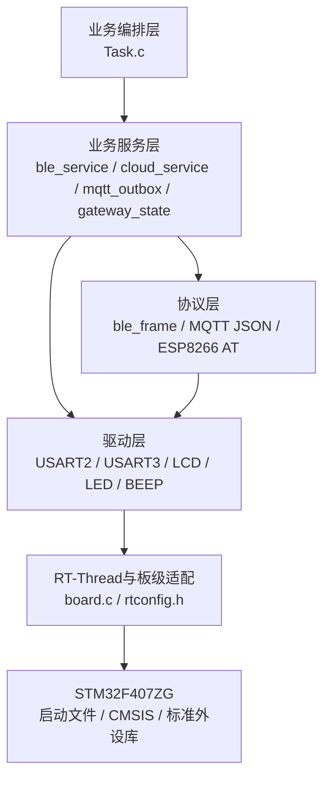
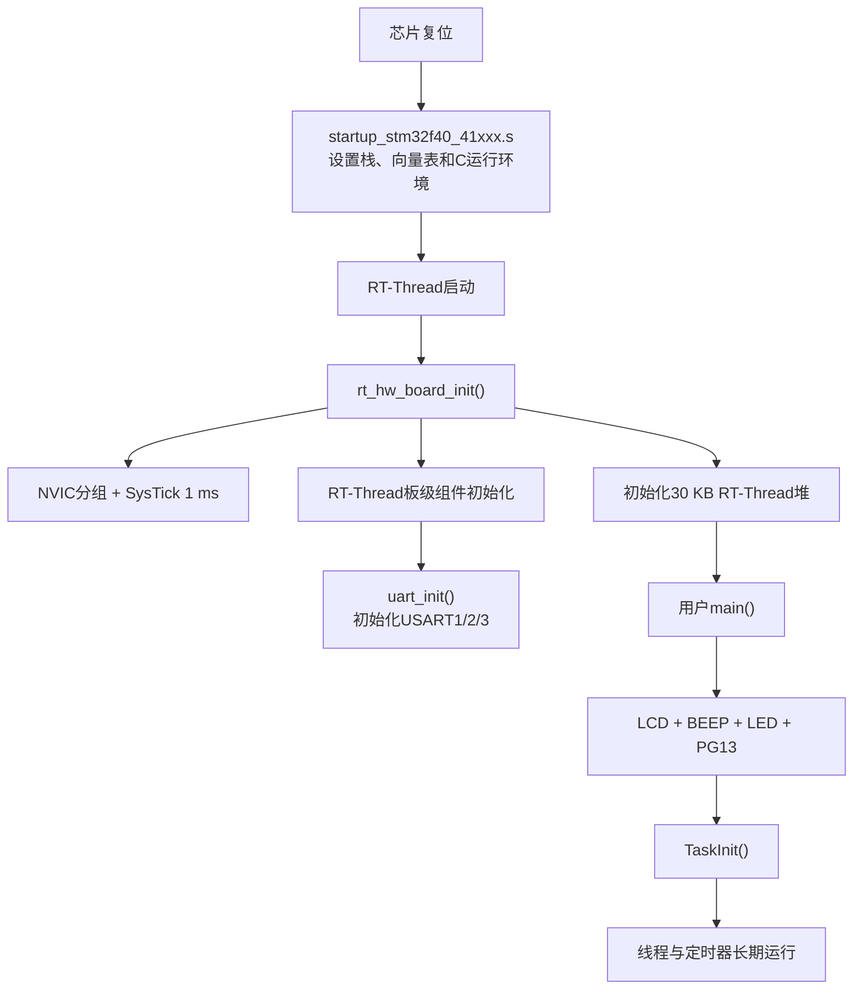
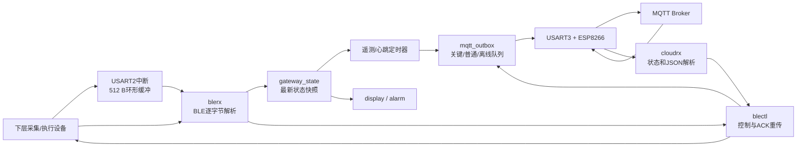
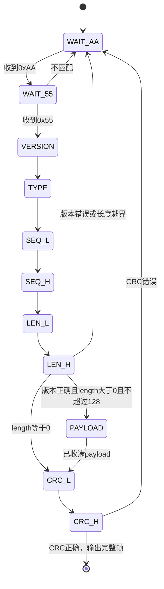
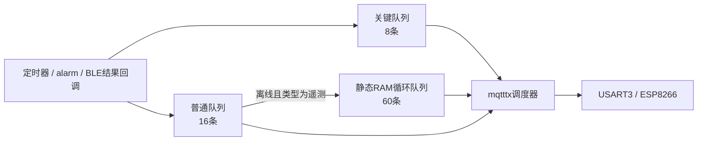
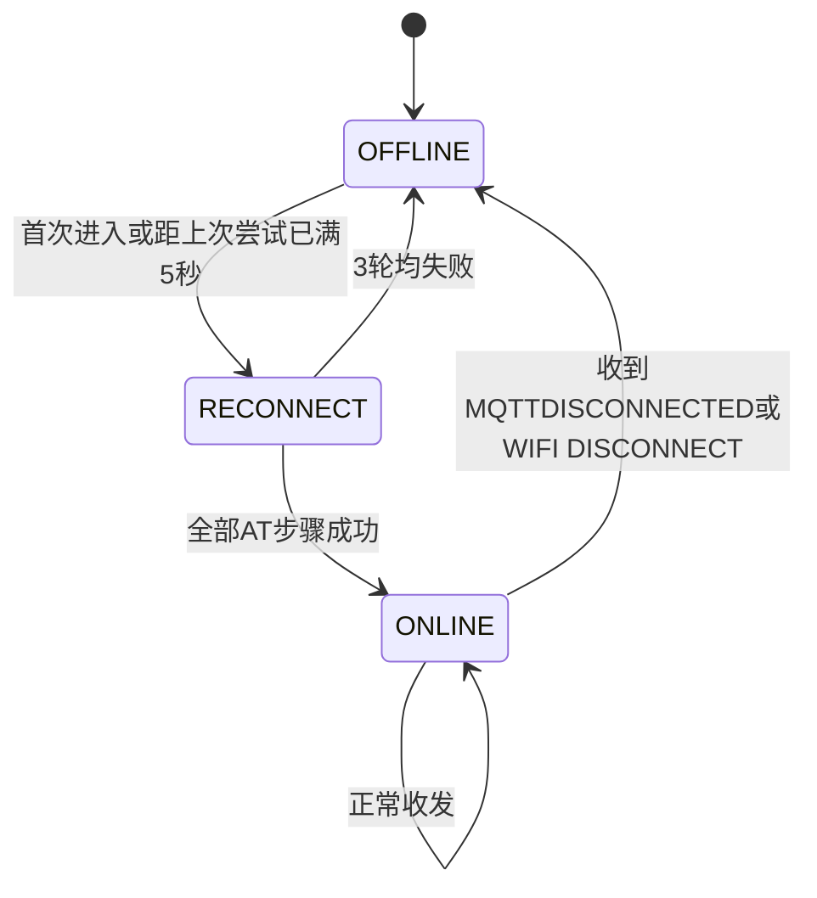
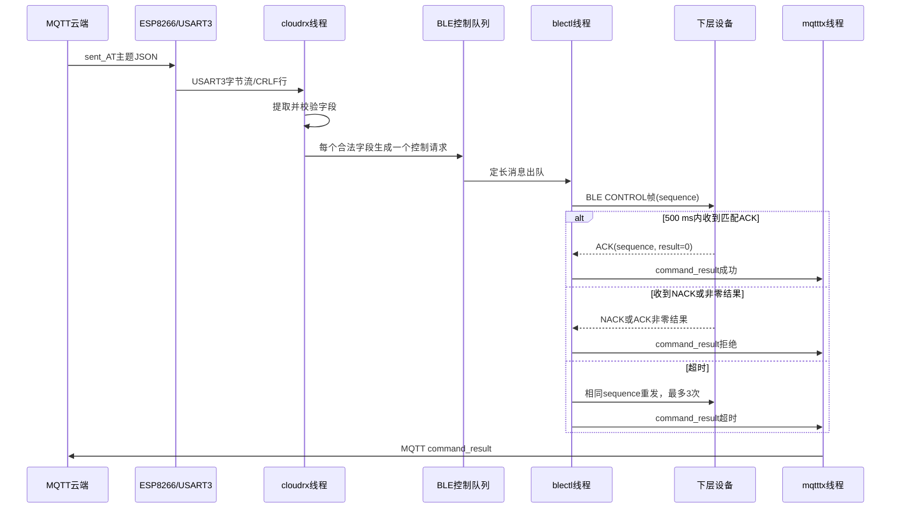

# 生鲜品储运系统工程逻辑框架说明

## 1. 这份文档解决什么问题

本文以当前仓库中的实际源码为准，目标不是简单罗列文件，而是帮助读者回答以下问题：

- 系统上电后从哪里开始执行？
- 中断、线程、定时器和消息队列分别负责什么？
- 下层 BLE 数据怎样一步步变成 MQTT 上报？
- 云端控制命令怎样到达下层设备，并怎样获得执行结果？
- 网络断开后怎样判断、重连、缓存和补传？
- 每个核心文件应该怎样阅读，关键函数之间是什么关系？
- 当前代码已经实现了什么，还有哪些限制和容易误读的地方？

如果第一次接触本工程，建议先阅读第 2～7 节建立全局认识，再按照第 8～12 节追踪具体数据流，最后利用第 17 节逐文件阅读源码。

> 本文会区分“系统设计意图”和“当前代码真实行为”。例如，USART3 设计上用于 ESP8266，但当前 `rt_hw_console_output()` 也会把 RT-Thread 控制台输出写到 USART3；这类实现细节会单独标记，避免文档与代码相互矛盾。

---

## 2. 用一句话理解整个系统

这是一个运行在 **STM32F407ZG + RT-Thread 3.1.5** 上的生鲜储运边缘网关：

> 下层设备通过 BLE 透明串口向网关上报温度、光照、电池和告警；网关解析并保存最新状态，通过 ESP8266 上传到 MQTT；云端命令则由网关转换成 BLE 控制帧，下发给设备并等待 ACK/NACK，再把结果返回云端。

系统的核心作用不是直接采集所有传感器，也不是直接实现所有执行器控制，而是完成四件事：

1. **协议转换**：BLE 二进制协议与 MQTT JSON/AT 指令之间转换；
2. **状态汇聚**：保存下层设备的最新状态快照；
3. **可靠通信**：BLE 控制超时重传，Wi-Fi/MQTT 断线重连；
4. **边缘处理**：本地显示、声光告警和短时断网数据缓存。

---

## 3. 硬件连接和三条串口

| 串口/外设 | 引脚 | 波特率 | 连接对象 | 当前用途 |
| --- | --- | ---: | --- | --- |
| USART1 | PA9/PA10 | 115200 | PC串口终端 | FinSH/MSH输入、`printf`重定向输出 |
| USART2 | PA2/PA3 | 115200 | BLE透明传输模块 | 下层设备二进制协议收发 |
| USART3 | PD8/PD9 | 115200 | ESP8266 | AT指令、Wi-Fi、MQTT收发 |
| BLE唤醒脚 | PG13 | — | BLE模块 | 启动时拉高，使模块进入工作状态 |
| 蜂鸣器 | PF8 | — | 本地告警 | 低电平有效 |
| LED0 | PF9 | — | 本地告警 | 低电平有效 |
| LCD | FSMC接口 | — | 本地显示 | 显示连接状态、遥测、告警和缓存状态 |

### 3.1 一个必须注意的串口实现细节

从产品职责看，USART1 应独立作为控制台，USART3 应独立连接 ESP8266。但当前 [`board.c`](USER/RTE/RTOS/board.c) 的行为是：

- `rt_hw_console_getchar()` 从 **USART1** 读取 FinSH/MSH 输入；
- `fputc()` 在 [`usart.c`](HARDWARE/blue/usart.c) 中把普通 `printf` 输出到 **USART1**；
- `rt_hw_console_output()` 却把 RT-Thread 控制台输出写到 **USART3**。

因此，调用 `rt_kprintf()` 或 RT-Thread 内部输出时，字符可能进入 ESP8266 的 AT 通道，与 MQTT/配网命令发生交叉。这不是系统期望的最终结构，而是当前代码中的遗留冲突。阅读和调试时要把“USART1控制台”和“RT-Thread控制台输出实现”分开理解。

---

## 4. 软件分层



### 4.1 各目录职责

| 目录 | 作用 | 阅读建议 |
| --- | --- | --- |
| `USER/` | 用户入口、Keil工程、STM32中断文件 | 先看 `main.c` 和 `Template.uvprojx` |
| `USER/RTE/RTOS/` | RT-Thread配置和板级初始化 | 理解系统时钟、堆、SysTick和串口初始化 |
| `HARDWARE/TASK/` | 业务编排 | 是理解整个工程的第一入口 |
| `HARDWARE/blue/` | BLE协议、BLE服务、云端服务、状态和MQTT队列 | 是主业务代码所在位置 |
| `HARDWARE/esp8266/` | ESP8266 AT配网和MQTT连接 | 理解联网、订阅和重连 |
| `HARDWARE/LCD/` | LCD底层驱动 | 业务只调用初始化、清屏和显示字符串接口 |
| `HARDWARE/LED/`、`BEEP/` | 本地声光输出 | 由告警线程直接控制GPIO宏 |
| `components/finsh/` | RT-Thread命令行组件 | 与主数据流关系较弱，用于调试 |
| `CORE/`、`FWLIB/`、`SYSTEM/` | 启动、CMSIS、标准外设库和基础宏 | 平台基础层，通常无需从头阅读 |
| `OBJ/` | Keil编译产物 | 不属于业务源码，不应手工修改 |

### 4.2 Keil构建入口

工程入口是 [`USER/Template.uvprojx`](USER/Template.uvprojx)：

- 芯片：STM32F407ZG，Cortex-M4F；
- 主频配置：168 MHz；
- Flash：1 MB；
- 主SRAM：128 KB，工程文件还声明了64 KB CCM RAM；
- 宏：`STM32F40_41xxx`、`USE_STDPERIPH_DRIVER`；
- RT-Thread动态堆：[`board.c`](USER/RTE/RTOS/board.c) 中静态分配30 KB。

虽然工程名仍叫 `Template`，但这只是历史模板名称，不代表当前业务仍是示例工程。

---

## 5. 推荐的代码阅读顺序

不要按照文件夹顺序逐个阅读。推荐分四轮：

### 第一轮：只看系统骨架

1. [`USER/main.c`](USER/main.c)：看应用层初始化入口；
2. [`HARDWARE/TASK/Task.c`](HARDWARE/TASK/Task.c)：看创建了哪些服务、线程和定时器；
3. 本文第 7 节并发模型：理解谁在什么时候执行。

这一轮只需要记住：`TaskInit()` 是业务总装函数。

### 第二轮：追踪下层数据上报

1. [`usart2.c`](HARDWARE/blue/usart2.c)：中断怎样保存字节；
2. [`ble_frame.c`](HARDWARE/blue/ble_frame.c)：字节流怎样恢复成完整帧；
3. [`ble_service.c`](HARDWARE/blue/ble_service.c)：不同帧类型怎样分发；
4. [`gateway_state.c`](HARDWARE/blue/gateway_state.c)：最新状态怎样共享；
5. [`mqtt_outbox.c`](HARDWARE/blue/mqtt_outbox.c)：状态怎样上传或缓存。

### 第三轮：追踪云端控制

1. [`usart3.c`](HARDWARE/blue/usart3.c)：ESP8266返回数据怎样进入环形缓冲；
2. [`cloud_service.c`](HARDWARE/blue/cloud_service.c)：怎样按行解析JSON字段；
3. `ble_service_send_control_i32()`：怎样生成控制请求；
4. `ble_command_thread_entry()`：怎样编码、发送、等ACK和重传；
5. [`command_result_callback()`](HARDWARE/TASK/Task.c)：怎样把结果放入MQTT关键队列。

### 第四轮：理解异常场景

1. [`wifista.c`](HARDWARE/esp8266/wifista.c)：配网和MQTT建立过程；
2. `cloud_rx_thread_entry()`：离线时如何触发重连；
3. `mqtt_outbox_thread_entry()`：离线数据如何转存和补传；
4. `ble_service_is_online()`：BLE如何通过超时判断失联；
5. `alarm_thread_entry()`：告警变化和链路失联如何上报。

---

## 6. 系统启动全过程

### 6.1 启动调用链



### 6.2 `rt_hw_board_init()` 做了什么

[`USER/RTE/RTOS/board.c`](USER/RTE/RTOS/board.c) 负责板级基础环境：

1. `NVIC_PriorityGroupConfig(NVIC_PriorityGroup_2)` 设置中断优先级分组；
2. `SystemCoreClockUpdate()` 更新系统主频变量；
3. `SysTick_Config()` 根据 `RT_TICK_PER_SECOND=1000` 产生1 ms系统节拍；
4. `rt_components_board_init()` 执行通过 `INIT_BOARD_EXPORT` 注册的初始化函数；
5. `uart_init()` 初始化USART1、USART2、USART3，均为115200；
6. `rt_system_heap_init()`注册30 KB静态数组作为RT-Thread动态堆。

这里容易误读的一点是：**USART2并不是在 `main()` 中初始化的**。它在板级组件初始化阶段已经由 `uart_init()` 调用了 `usart2_init(115200)`。

### 6.3 `main()` 做了什么

[`USER/main.c`](USER/main.c) 的职责很少：

```text
LCD_Init()
  → LCD_Clear(WHITE)
  → BEEP_Init()
  → LED_Init()
  → Ble_IoInit()       // 只配置PG13并拉高，不重复初始化USART2
  → TaskInit()
  → return 0
```

`main()` 返回并不表示系统结束。它只是RT-Thread创建的主线程入口，业务线程和定时器仍由调度器继续执行。

### 6.4 `TaskInit()` 的真实顺序

[`TaskInit()`](HARDWARE/TASK/Task.c) 是业务装配中心：

1. `gateway_state_init()`：清零下层设备状态快照；
2. `mqtt_outbox_init()`：创建关键/普通消息队列和 `mqtttx` 线程；
3. `ble_service_init()`：创建BLE信号量、控制队列、`blerx`和`blectl`线程；
4. 注册 `command_result_callback()`；
5. 同步调用 `atk_8266_wifista_config()`，最多进行3轮配网；
6. `cloud_service_init()`：创建 `cloudrx` 线程；
7. 创建 `display` 和 `alarm` 线程；
8. 创建并启动2秒遥测定时器、10秒心跳定时器。

### 6.5 当前启动联网存在的一次重复动作

`atk_8266_wifista_config()` 成功时会调用 `cloud_service_set_online(1)`。但紧接着执行的 `cloud_service_init()` 又会执行 `cloud_online = 0`。因此，当前代码的实际效果是：

1. 主线程启动阶段可能已经成功完成一次Wi-Fi/MQTT连接；
2. 初始化 `cloudrx` 时逻辑在线状态被清零；
3. `cloudrx` 启动后立即认为离线，再执行一次完整配网流程。

这不是理解错误，而是当前初始化顺序与状态初始化之间的冲突。后续代码优化时可以先初始化云端服务再配网，或者避免 `cloud_service_init()`覆盖已建立的在线状态。

---

## 7. RT-Thread并发模型

### 7.1 为什么需要“中断 + 缓冲区 + 线程”

UART字节可能随时到达，中断必须尽快完成。如果直接在中断里执行CRC、JSON解析、LCD刷新或等待ACK，会长时间占用CPU并影响其他中断。

本工程采用统一模式：

```text
UART接收中断：读取1字节 → 放入环形缓冲 → 释放信号量 → 立即返回
工作线程：等待信号量 → 排空缓冲 → 解析协议 → 执行业务
```

这条模式是理解 `USART2_IRQHandler()`、`USART3_IRQHandler()`、`blerx` 和 `cloudrx` 的关键。

### 7.2 线程与定时器一览

| 实体 | 优先级 | 栈 | 唤醒方式 | 职责 |
| --- | ---: | ---: | --- | --- |
| `blerx` | 5 | 768 B | USART2中断释放信号量 | 排空BLE字节环形缓冲、组帧、更新状态、处理ACK/NACK |
| `blectl` | 6 | 768 B | BLE控制消息队列 | 串行下发控制、等待500 ms应答、最多发送3次 |
| `cloudrx` | 7 | 1024 B | USART3信号量或500 ms超时 | 解析ESP8266行数据、识别连接状态、路由云端命令、离线重连 |
| `mqtttx` | 7 | 1024 B | MQTT消息队列/短超时轮询 | MQTT单写者、优先级调度、离线转存和补传 |
| `alarm` | 10 | 768 B | 每100 ms主动轮询 | 控制蜂鸣器/LED，发布告警变化和BLE失联 |
| `display` | 12 | 1024 B | 每500 ms主动轮询 | 显示连接状态、遥测、告警和缓存统计 |
| FinSH/MSH | 默认21 | 组件配置 | 控制台输入 | 调试命令行 |
| `telemetry` | 定时器 | — | 每2秒 | 复制最新快照并提交结构化遥测 |
| `heartbeat` | 定时器 | — | 每10秒 | 生成并提交网关心跳 |

RT-Thread中数字越小，线程优先级越高。因此BLE接收和控制优先于显示与普通告警呈现。

### 7.3 定时器回调的执行上下文

[`rtconfig.h`](USER/RTE/RTOS/rtconfig.h) 中没有启用 `RT_USING_TIMER_SOFT`，因此这里创建的是RT-Thread硬定时器，回调由系统Tick检查触发，属于中断相关执行路径。当前回调中会复制状态、格式化心跳字符串并向消息队列投递。

理解代码时应记住：定时器回调不是独立业务线程。后续如果回调逻辑继续增长，推荐让回调只释放信号量或投递轻量事件，把JSON格式化等工作放在线程中执行。

### 7.4 共享资源和所有者

| 资源 | 写入者 | 读取者 | 保护方式 |
| --- | --- | --- | --- |
| BLE RX环形缓冲 | USART2 ISR推进`head` | `blerx`推进`tail` | 单生产者单消费者结构，满时丢新字节 |
| UART3 RX环形缓冲 | USART3 ISR推进`head` | 启动配网函数或`cloudrx`推进`tail` | 不同时期只有一个常规消费者 |
| `gateway_state` | `blerx`线程 | 定时器、显示、告警线程 | 关中断短临界区，按值复制完整快照 |
| BLE控制队列 | `cloudrx`等调用者 | `blectl`线程 | RT-Thread消息队列，深度8 |
| BLE ACK状态 | `blerx`写 | `blectl`读 | sequence校验 + 信号量同步 |
| MQTT关键队列 | 告警、控制结果 | `mqtttx` | RT-Thread消息队列，深度8 |
| MQTT普通队列 | 遥测、心跳 | `mqtttx` | RT-Thread消息队列，深度16 |
| 离线遥测循环队列 | `mqtttx` | `mqtttx`，显示线程读计数 | 临界区保护，固定60条 |
| USART2 TX | `blectl` | BLE模块 | 控制请求由单线程串行发送 |
| USART3 TX | `mqtttx`或配网流程 | ESP8266 | `cloud_online`用于逻辑隔离，但没有统一串口互斥锁 |

---

## 8. 主数据流总览



系统有三条主要业务路径：

1. **遥测上行**：下层设备 → BLE → 状态快照 → MQTT；
2. **控制下行**：云端 → MQTT/ESP8266 → BLE控制 → 下层设备 → ACK结果 → MQTT；
3. **异常恢复**：断网 → RAM缓存 → 自动重连 → FIFO补传。

下面分别展开。

---

## 9. 遥测上行：从一个UART字节到云端JSON

### 9.1 完整函数链

```text
下层BLE模块收到无线数据
  → USART2产生RXNE中断
  → USART2_IRQHandler()
  → ble_uart_rx_push_isr(byte)
  → ble_service_notify_rx_isr()
  → rt_sem_release(&ble_rx_sem)
  → blerx线程被唤醒
  → ble_uart_rx_pop(&byte)
  → ble_frame_parser_feed()
  → ble_dispatch_frame()
  → gateway_state_update_telemetry()
  → 2秒遥测定时器读取gateway_state_snapshot()
  → mqtt_outbox_submit_telemetry()
  → mqtttx线程决定在线发送或离线缓存
  → uart3_write("AT+MQTTPUB...")
  → ESP8266发布到MQTT Broker
```

### 9.2 USART2中断只做什么

[`USART2_IRQHandler()`](HARDWARE/blue/usart2.c) 每收到一个字节：

1. 从USART2数据寄存器读取字节；
2. 调用 `ble_uart_rx_push_isr()` 放入512字节环形缓冲；
3. 调用 `ble_service_notify_rx_isr()` 释放接收信号量；
4. 清除中断标志并返回。

环形缓冲留一个空槽区分“满”和“空”，所以标称512字节实际最多保存511字节：

- `head == tail`：缓冲区为空；
- `(head + 1) % 512 == tail`：缓冲区已满；
- 满时不能在中断中等待，直接丢弃新字节并增加 `ble_rx_overflow`。

信号量只表示“可能有数据”，不代表“一次信号对应一个字节”。因此 `blerx` 醒来后使用 `while (ble_uart_rx_pop())` 一次排空全部已接收字节。

### 9.3 BLE帧解析状态机

帧格式：

```text
AA 55 | version(1) | type(1) | sequence(2) | length(2) | payload(N) | CRC16(2)
```

所有多字节字段使用小端序。最大载荷128字节，总帧最大138字节。

[`ble_frame_parser_feed()`](HARDWARE/blue/ble_frame.c) 每次只接收一个字节，其状态变化为：



CRC16-Modbus覆盖 `version` 到 `payload`，不包含 `AA 55`帧头，也不包含CRC自身。CRC正确时函数返回1并输出完整 `ble_frame_t`；错误时丢弃当前帧并重新寻找帧头。

### 9.4 帧类型怎样分发

`ble_dispatch_frame()` 首先做统一动作：

- 更新 `ble_last_rx_tick`；
- 标记曾经见过合法帧；
- 清除本次失联已上报标志；
- 有效帧计数加一。

然后根据 `type` 分发：

| 类型 | 条件 | 处理 |
| ---: | --- | --- |
| `0x10` 遥测 | `length >= 11` | 解码温度、光照、电池和状态，更新状态快照 |
| `0x11` 告警 | `length >= 1` | 更新 `alarm_code` |
| `0x7E` ACK | 长度和sequence合法 | 唤醒等待控制结果的 `blectl` |
| `0x7F` NACK | 长度和sequence合法 | 唤醒 `blectl`并标记拒绝 |
| `0x01` 心跳 | 合法帧即可 | 当前不解析payload，但会刷新BLE在线时间 |
| 其他类型 | — | 当前没有业务处理，但合法帧仍刷新在线时间 |

### 9.5 遥测负载怎样解码

`0x10`遥测负载固定使用前11字节：

| 偏移 | 字段 | 类型 | 转换方式 |
| ---: | --- | --- | --- |
| 0～1 | `tin_x100` | `int16` | 除以100得到内部温度℃ |
| 2～3 | `tout_x100` | `int16` | 除以100得到外部温度℃ |
| 4～7 | `lux_x10` | `uint32` | 除以10得到光照lx |
| 8～9 | `battery_mv` | `uint16` | 直接作为mV |
| 10 | `device_status` | `uint8` | 下层设备状态字节 |

例如 `tin_x100 = 1234` 表示12.34℃，`tin_x100 = -550` 表示-5.50℃。

### 9.6 为什么要有 `gateway_state`

[`gateway_state.c`](HARDWARE/blue/gateway_state.c) 把通信层收到的数据转换为业务层易用的最新状态：

```c
typedef struct
{
    float tin_c;
    float tout_c;
    float illuminance_lux;
    u16 battery_mv;
    u8 device_status;
    u8 alarm_code;
    u8 telemetry_valid;
} gateway_state_snapshot_t;
```

这样显示、告警和MQTT上报不需要理解BLE原始字节格式，只读取统一快照。

所有遥测字段在一次短暂关中断临界区内更新；读取时也整体复制，所以业务线程不会读到“温度来自新帧、电池却来自旧帧”的混合状态。该对象只保存**最新值**，不保存历史数据。

### 9.7 2秒遥测怎样产生

`telemetry_timer_callback()` 每2秒：

1. 调用 `gateway_state_snapshot()` 复制最新状态；
2. 若还没有收到过有效遥测，即 `telemetry_valid == 0`，直接返回；
3. 调用 `mqtt_outbox_submit_telemetry()`，把快照按值复制到普通消息队列；
4. 此时不立即拼接长AT字符串，真正发送时才格式化JSON。

在线实时遥测最终发布到 `sensor_data`：

```json
{
  "device_id": "202102",
  "Tin": 12.34,
  "Tout": 20.00,
  "LXin": 200.0,
  "battery_mv": 3700,
  "status": 1,
  "ble_online": 1
}
```

---

## 10. MQTT发送调度和断线缓存

### 10.1 为什么所有发布都交给 `mqtttx`

告警线程、定时器、BLE控制回调都可能同时产生云端消息。如果它们直接写USART3，多个 `AT+MQTTPUB` 字符串可能交叉，ESP8266将无法解析。

因此业务生产者只负责“提交消息”，由 `mqtttx` 作为主要MQTT发布写线程统一发送。

### 10.2 三层消息结构



| 队列 | 保存内容 | 满时行为 |
| --- | --- | --- |
| 关键队列 | `fault`、`command_result` | 丢弃新消息，关键丢弃计数加一 |
| 普通队列 | 实时遥测、心跳 | 丢弃新消息，普通丢弃计数加一 |
| 离线遥测队列 | 断网期间的结构化遥测快照 | 保留旧数据，丢弃新数据，`offline_drops`加一 |

每个RT-Thread消息队列元素是定长结构，内部预留384字节命令缓冲，因此队列深度不仅影响排队能力，也会占用明显的30 KB动态堆。

### 10.3 在线发送顺序

当 `cloud_online == 1` 时，`mqtttx` 每轮按以下顺序选择一条消息：

```text
关键消息
  > 离线历史遥测（FIFO）
  > 新的普通消息
```

这意味着网络恢复后，先上传故障和控制结果，再补历史数据，最后发送新普通消息。

### 10.4 断网时怎样转存

当 `cloud_online == 0` 时：

1. `mqtttx`不会向ESP8266发送MQTT发布命令；
2. 它仍每100 ms尝试从普通队列取消息，防止普通队列先被填满；
3. 若消息类型是遥测，则保存到60条静态RAM循环队列；
4. 若消息是心跳等普通字符串命令，则直接丢弃，因为旧心跳没有补传价值；
5. 关键队列不会被消费，故障和控制结果留在队列中等待恢复。

离线队列保存：完整遥测快照、采集时BLE在线状态、转入缓存时的系统Tick。

### 10.5 容量和满队列策略

- 默认容量：60条；
- 遥测周期：2秒；
- 理论覆盖时间：约120秒；
- 缓存介质：静态RAM；
- 满时策略：保留较早数据，丢弃新遥测；
- 掉电/复位：缓存全部丢失。

这不是EEPROM或Flash持久化。它适合过滤短时网络波动，不适合需要跨掉电保存的业务。

### 10.6 恢复后怎样补传

网络恢复后，历史遥测按FIFO出队，增加两个字段：

```json
{
  "offline": 1,
  "offline_age_ms": 45000
}
```

`offline_age_ms` 是从转入缓存到补传时经过的相对时间，不是RTC绝对采样时间。

### 10.7 当前“已发送”的真实定义

历史数据在调用 `uart3_write()` 把AT命令写给ESP8266后就已经从本地队列删除。代码没有等待：

- ESP8266明确返回发布成功；
- MQTT Broker的PUBACK；
- 云端业务确认。

因此当前实现保证的是“按顺序尝试补发”，不能保证Broker一定接收，也不能做到端到端不丢。产品级方案需要发送确认、消息ID和云端幂等去重。

---

## 11. 云端联网、断线判断和自动重连

### 11.1 首次配网AT流程

[`atk_8266_wifista_config()`](HARDWARE/esp8266/wifista.c) 每轮依次执行：

```text
AT+RST
  → 等待 ready
ATE0
  → 等待 OK
AT+CWMODE=1
  → 等待 OK
AT+CWJAP="SSID","PASSWORD"
  → 等待 WIFI GOT IP
AT+MQTTUSERCFG=...
  → 等待 OK
AT+MQTTCONN=...
  → 等待 OK
AT+MQTTSUB=0,"sent_AT",0
  → 等待 OK
cloud_online = 1
```

任一步失败就从 `AT+RST` 重新开始，最多3轮。网络配置保存在被Git忽略的 `wifi_config.h`，仓库只提供 [`wifi_config.example.h`](HARDWARE/esp8266/wifi_config.example.h)。

### 11.2 AT响应怎样接收

USART3中断把字节放入1024字节环形缓冲。配网函数每10 ms调用 `esp8266_collect_response()` 排空缓冲，并使用 `strstr()` 检查期望文本。

UART3接收缓冲有两个不同时期的消费者：

- 启动阶段：主线程中的 `atk_8266_wifista_config()`；
- 正常运行：`cloudrx`线程；
- 运行期重连：仍由 `cloudrx`线程同步调用配网函数。

因此设计上不会让两个线程同时常规读取同一个缓冲，但代码依赖调用顺序来维持这个约束。

### 11.3 当前怎样判断云端在线

`cloud_online` 是一个逻辑状态标志，来源有两类：

1. 完整AT配网流程成功后主动置1；
2. `cloudrx`解析ESP8266串口状态文本。

| 串口内容 | 状态变化 |
| --- | --- |
| 包含 `MQTTCONNECTED` | `cloud_online = 1` |
| 包含 `MQTT CONNECTED` | `cloud_online = 1` |
| 包含 `MQTTDISCONNECTED` | `cloud_online = 0` |
| 包含 `WIFI DISCONNECT` | `cloud_online = 0` |

系统没有定期主动查询Wi-Fi/MQTT状态，也没有通过应用层发布确认验证链路。因此如果路由器、Broker或ESP8266进入静默异常，却没有输出上述断线文本，STM32可能继续认为在线。

### 11.4 自动重连状态机



`cloudrx`每次等待USART3信号量最多500 ms，因此即使没有任何串口字节，也能周期检查重连条件。离线时每隔5秒调用一次完整配网函数；函数内部最多尝试3轮。

当前使用固定5秒间隔，不是指数退避；每轮又会复位ESP8266。长时间断网时会持续重复这一过程。

### 11.5 配网期间为什么 `mqtttx` 应暂停

`atk_8266_wifista_config()` 开始时先执行 `cloud_service_set_online(0)`，使 `mqtttx`进入离线分支，避免在配网AT命令中插入 `AT+MQTTPUB`。

但USART3没有真正的发送互斥锁，当前隔离依赖状态标志和单线程流程；再加上RT-Thread控制台输出也写USART3，因此仍存在命令交叉风险。这是后续应优先修正的结构问题。

---

## 12. 云端控制闭环

### 12.1 整体时序



### 12.2 USART3数据怎样变成一行命令

`cloudrx`线程排空UART3环形缓冲：

- 忽略 `\r`；
- 遇到 `\n` 表示一行结束；
- 一行最大511个字符；
- 超过长度时将当前行长度清零；
- 只有包含 `{` 的行才尝试解析业务命令。

这意味着系统依赖ESP8266 AT固件把订阅消息以CRLF分行输出。

### 12.3 JSON字段怎样解析

当前没有完整JSON库，而是：

1. `cloud_value()` 用 `strstr()`寻找`"字段名"`；
2. 跳过空格、冒号和引号；
3. 整数用 `strtol()`；
4. 浮点阈值用 `strtof()`后乘100转成定点整数；
5. 越界字段不发送。

这种方法代码小，适合格式固定、来源受控的消息，但不具备完整JSON语法校验能力。例如嵌套对象、转义字符串、相似字段名和复杂格式都可能造成误判。

### 12.4 云端字段映射

| 云端字段 | 校验范围 | BLE控制ID | 下发值 |
| --- | ---: | ---: | --- |
| `mode` | `open`/`close` | `0x01` | 1/0 |
| `SpeedM1` | 0～100 | `0x02` | `int32`原值 |
| `SpeedM2` | 0～100 | `0x03` | `int32`原值 |
| `SpeedM3` | 0～100 | `0x04` | `int32`原值 |
| `TinDH` | 当前未限定范围 | `0x05` | 浮点数×100 |
| `TinDL` | 当前未限定范围 | `0x06` | 浮点数×100 |
| `TG` | 当前未限定范围 | `0x07` | 浮点数×100 |
| `LXD` | 0～200000 | `0x08` | `int32`原值 |

一条JSON可以同时包含多个字段。每个合法字段都会生成一条独立BLE控制请求，拥有独立sequence和独立执行结果。

> 协议文档把 `0x08` 描述为 `lx ×10`，而当前 `cloud_service.c` 对 `LXD` 整数没有乘10。这要求云端约定与下层实现保持一致，否则会出现单位偏差。

### 12.5 BLE控制请求怎样入队

`ble_service_send_control_i32()` 把32位值编码成4字节小端序，再调用 `ble_service_send_control()`：

1. 在关中断临界区中分配递增sequence，初值为1；
2. 若BLE当前离线，立即回调结果码4，不进入队列；
3. 若深度8的控制队列已满，立即回调结果码3；
4. 否则把完整定长请求按值复制进队列。

sequence是16位无符号数，长期运行后会回绕。当前一次只串行等待一个请求，所以短时间内不会同时等待两个相同sequence。

### 12.6 `blectl`怎样发送和等待

`blectl`线程一次只处理一个控制请求：

1. 构造 `BLE_MSG_CONTROL (0x20)`帧；
2. payload第1字节是control ID，后面是控制数据；
3. 调用 `ble_frame_encode()`添加帧头、长度和CRC；
4. 清空ACK信号量中可能残留的历史通知；
5. 设置当前等待的sequence；
6. 通过USART2阻塞发送完整帧；
7. 最多等待500 ms；
8. 超时则用**相同sequence**重发，最多3次。

使用相同sequence是为了让下层设备识别重试。下层设备必须保证幂等：同一sequence的重复控制帧不能再次驱动执行器，只应重发上一次结果。

### 12.7 ACK/NACK怎样匹配

`blerx`收到ACK/NACK后，只有同时满足以下条件才唤醒 `blectl`：

- 类型是 `0x7E` 或 `0x7F`；
- payload至少2字节；
- `payload[0] == BLE_MSG_CONTROL (0x20)`；
- 帧sequence等于当前 `ble_waiting_sequence`。

结果判断：

- ACK并且 `payload[1] == 0`：成功；
- NACK或非零结果：下层拒绝；
- 500 ms内无匹配应答：继续重试；
- 3次都超时：最终超时。

### 12.8 控制结果怎样返回云端

`blectl`同步调用在 `Task.c` 注册的 `command_result_callback()`。回调只拼接命令并投递到MQTT关键队列，不直接写USART3，从而避免阻塞BLE控制线程。

结果发布主题为 `command_result`：

```json
{
  "device_id": "202102",
  "sequence": 17,
  "command": "fan_speed",
  "result": 0,
  "attempts": 1
}
```

| result | 含义 |
| ---: | --- |
| 0 | 下层执行成功 |
| 1 | 下层ACK结果非零或返回NACK |
| 2 | 3次发送均未收到匹配应答 |
| 3 | 网关BLE控制队列已满 |
| 4 | 提交请求时BLE离线 |

---

## 13. BLE在线、失联和本地告警

### 13.1 BLE怎样判断在线

任何通过版本、长度和CRC校验的合法BLE帧都会更新 `ble_last_rx_tick`。`ble_service_is_online()` 判断：

```text
从未收到合法帧 → 离线
当前Tick - 最后合法帧Tick < 15秒 → 在线
超过或等于15秒 → 离线
```

这里判断的是“协议层最近是否收到过合法帧”，不是BLE模块物理连接脚状态。即使串口有噪声，只要无法组成合法帧，仍不会被判断为在线。

### 13.2 BLE失联怎样只上报一次

`ble_service_poll_link_lost()` 只有在以下条件同时成立时返回1：

- 系统曾经收到过合法BLE帧；
- 当前已经超时离线；
- 本次失联周期尚未上报。

冷启动时从未见过下层设备，不会立即产生失联故障；恢复在线后允许下一个失联周期再次上报。

### 13.3 告警线程做什么

`alarm`线程每100 ms读取状态快照：

1. `alarm_code != 0`时，PF8蜂鸣器和PF9 LED0输出低电平；
2. `alarm_code == 0`时，两者输出高电平；
3. 只有告警码从其他值变化为非零时，才向 `fault` 主题提交一次故障；
4. BLE失联边沿也向 `fault` 主题提交一次 `ble_link_lost`。

当前告警清除不会向云端发布“恢复”消息，只会停止本地声光输出，并允许后续新的非零变化再次上报。

### 13.4 本地显示

`display`线程每500 ms刷新：

```text
BLE:ON/OFF  CLOUD:ON/OFF
Tin / Tout
Lux / Battery
Alarm / Device Status
Cache / Drop
```

- `Cache`：当前离线遥测待补传条数；
- `Drop`：离线队列满后累计丢弃的新遥测数。

显示线程只读取服务接口和状态快照，不直接处理UART或网络协议。

---

## 14. BLE协议速查

详细规范见 [`DEVICE_BLE_PROTOCOL.md`](HARDWARE/blue/DEVICE_BLE_PROTOCOL.md)。

### 14.1 通用帧

```text
偏移  长度  字段
0     1     0xAA
1     1     0x55
2     1     version = 0x01
3     1     type
4     2     sequence，小端
6     2     payload_length，小端
8     N     payload
8+N   2     CRC16-Modbus，小端
```

### 14.2 消息类型

| type | 名称 | 方向 |
| ---: | --- | --- |
| `0x01` | HEARTBEAT | 下层 → 网关 |
| `0x10` | TELEMETRY | 下层 → 网关 |
| `0x11` | ALARM | 下层 → 网关 |
| `0x20` | CONTROL | 网关 → 下层 |
| `0x21` | CONFIG | 已定义，当前主业务未使用 |
| `0x7E` | ACK | 下层 → 网关 |
| `0x7F` | NACK | 下层 → 网关 |

### 14.3 当前协议没有实现的内容

- 超过128字节的大数据分片；
- 滑动窗口和选择性重传；
- 文件级CRC32和断点续传；
- 加密、身份认证和防重放；
- 控制请求持久化；
- 下层遥测绝对时间戳。

因此当前协议适用于短控制帧和固定遥测，不等同于已经实现了大文件可靠传输。

---

## 15. MQTT主题和消息速查

| 主题 | 方向 | 优先级 | 说明 |
| --- | --- | --- | --- |
| `sent_AT` | 云端 → 网关 | — | ESP8266连接后订阅，承载JSON控制字段 |
| `sensor_data` | 网关 → 云端 | 普通 | 2秒周期遥测，离线期间可缓存60条 |
| `heartbeat` | 网关 → 云端 | 普通 | 10秒心跳，不补传历史心跳 |
| `fault` | 网关 → 云端 | 关键 | 下层告警变化或BLE链路失联 |
| `command_result` | 网关 → 云端 | 关键 | BLE控制成功、拒绝、超时、队列满或离线结果 |

当前所有发布命令的MQTT QoS参数均为0，retain参数为0：

```text
AT+MQTTPUB=0,"topic","json",0,0
```

因此MQTT层本身不提供QoS 1的PUBACK保证。

---

## 16. 典型运行场景

### 16.1 正常上电

1. RT-Thread初始化时钟、堆和三路串口；
2. `main()`初始化LCD、声光输出和BLE唤醒脚；
3. `TaskInit()`创建通信服务；
4. ESP8266连接Wi-Fi和MQTT并订阅 `sent_AT`；
5. 下层设备发送第一帧合法遥测后BLE变为在线；
6. 每2秒上传最新遥测，每10秒上传心跳；
7. LCD每500 ms刷新。

### 16.2 下层设备暂时断开

1. 15秒没有合法BLE帧；
2. `ble_service_is_online()`返回0；
3. 告警线程第一次检测到失联，提交一次 `ble_link_lost`；
4. 新的云端控制请求立即返回结果4，不进入BLE队列；
5. 再次收到合法帧时恢复在线，并允许下一次失联重新告警。

### 16.3 Wi-Fi断开

1. ESP8266输出 `WIFI DISCONNECT`；
2. `cloudrx`把 `cloud_online`置0；
3. `mqtttx`暂停发布，周期遥测转存RAM循环队列；
4. 心跳被丢弃，关键事件留在关键队列；
5. `cloudrx`每5秒尝试完整重连；
6. 成功后先发关键事件，再补历史遥测，最后发送实时普通消息。

### 16.4 云端一次下发多个字段

例如：

```json
{"mode":"open","SpeedM1":60,"TinDH":8.50}
```

`cloudrx`会生成3个独立BLE请求：模式、风机速度、温度上限。`blectl`串行执行，每个请求都有独立sequence、重试过程和 `command_result`。

### 16.5 BLE控制ACK丢失

1. 下层可能已执行第一次控制，但ACK在链路中丢失；
2. 网关500 ms后使用相同sequence重发；
3. 下层识别重复sequence，不再次操作执行器，只重发原结果；
4. 网关收到匹配ACK后上报成功和实际尝试次数。

这就是下层必须实现幂等处理的原因。

---

## 17. 核心文件逐个看懂

### 17.1 启动和业务装配

#### [`USER/main.c`](USER/main.c)

- 入口：`main()`；
- 只做产品外设初始化和调用 `TaskInit()`；
- 不包含长期循环；
- 阅读重点：明确 `main()`返回后RTOS仍然运行。

#### [`USER/RTE/RTOS/board.c`](USER/RTE/RTOS/board.c)

- `rt_hw_board_init()`：时钟节拍、组件和堆；
- `uart_init()`：初始化USART1/2/3；
- `SysTick_Handler()`：驱动RT-Thread Tick；
- `rt_hw_console_getchar()`：USART1控制台输入；
- `rt_hw_console_output()`：当前实际输出到USART3，是需要关注的冲突点。

#### [`HARDWARE/TASK/Task.c`](HARDWARE/TASK/Task.c)

- `TaskInit()`：业务模块总装；
- `telemetry_timer_callback()`：周期提交结构化遥测；
- `heartbeat_timer_callback()`：周期提交心跳；
- `display_thread_entry()`：LCD展示；
- `alarm_thread_entry()`：声光告警和故障上报；
- `command_result_callback()`：BLE结果转换为MQTT关键消息。

### 17.2 BLE链路

#### [`usart2.c`](HARDWARE/blue/usart2.c)

- `usart2_init()`：GPIO、USART和NVIC；
- `USART2_IRQHandler()`：接收字节并唤醒 `blerx`；
- `ble_uart_rx_push_isr()` / `pop()`：512字节SPSC环形缓冲；
- `ble_uart_write()`：阻塞式发送BLE帧；
- `Ble_IoInit()`：只配置PG13唤醒脚。

#### [`ble_frame.c`](HARDWARE/blue/ble_frame.c)

- `ble_crc16_modbus()`：CRC算法；
- `ble_frame_parser_feed()`：逐字节解析状态机；
- `ble_frame_encode()`：将结构体编码为线上的二进制帧；
- 阅读重点：小端序、CRC范围、长度上限和错误后重新寻帧。

#### [`ble_service.c`](HARDWARE/blue/ble_service.c)

- `ble_rx_thread_entry()`：从环形缓冲取字节并解析；
- `ble_dispatch_frame()`：遥测、告警和ACK/NACK分发；
- `ble_command_thread_entry()`：控制下发、ACK等待和重试；
- `ble_service_is_online()`：15秒合法帧超时；
- `ble_service_send_control()`：sequence分配、离线/队列满判断和入队。

### 17.3 状态和云端

#### [`gateway_state.c`](HARDWARE/blue/gateway_state.c)

- 保存最新遥测和告警；
- 写入时完成定点数到浮点单位转换；
- 使用短关中断临界区保证多字段快照一致；
- 不保存历史记录和绝对时间戳。

#### [`cloud_service.c`](HARDWARE/blue/cloud_service.c)

- `cloud_rx_thread_entry()`：UART3唯一正常运行消费者；
- `cloud_process_line()`：连接文本和JSON入口；
- `cloud_value()`、`cloud_int()`、`cloud_float_x100()`：轻量字段解析；
- `cloud_route_commands()`：云端字段到BLE控制ID映射；
- `cloud_service_is_online()`：返回逻辑在线状态。

#### [`mqtt_outbox.c`](HARDWARE/blue/mqtt_outbox.c)

- `mqtt_outbox_submit()`：提交已经拼好的AT发布命令；
- `mqtt_outbox_submit_telemetry()`：提交结构化遥测；
- `mqtt_outbox_thread_entry()`：优先级调度、在线发送、离线转存和补传；
- `mqtt_offline_enqueue/dequeue()`：60条静态循环队列；
- `mqtt_make_telemetry_command()`：最终JSON和AT命令格式化。

### 17.4 ESP8266和外设

#### [`wifista.c`](HARDWARE/esp8266/wifista.c)

- `atk_8266_send_cmd()`：发AT命令并轮询期望响应；
- `atk_8266_wifista_config()`：复位、入网、MQTT连接和订阅；
- 配网是同步阻塞流程；
- 配网期间依赖 `cloud_online=0`暂停MQTT发布。

#### `lcd.c`、`led.c`、`beep.c`

- 属于硬件驱动层；
- 业务入口集中在 `Task.c`；
- 理解主逻辑时不必先阅读LCD控制器寄存器初始化细节。

---

## 18. 关键常量速查

| 常量 | 当前值 | 含义 |
| --- | ---: | --- |
| `RT_TICK_PER_SECOND` | 1000 | 1 ms系统Tick |
| `RT_HEAP_SIZE` | 30 KB | RT-Thread动态堆 |
| `BLE_UART_RX_RING_SIZE` | 512 | BLE接收环形缓冲，实际容量511字节 |
| `UART3_RX_RING_SIZE` | 1024 | ESP8266接收环形缓冲，实际容量1023字节 |
| `BLE_MAX_PAYLOAD` | 128 | BLE帧最大payload |
| `BLE_ONLINE_TIMEOUT_MS` | 15000 | BLE合法帧超时离线时间 |
| `BLE_COMMAND_QUEUE_DEPTH` | 8 | BLE控制请求队列深度 |
| `BLE_COMMAND_ACK_TIMEOUT_MS` | 500 | 单次ACK等待时间 |
| `BLE_COMMAND_MAX_ATTEMPTS` | 3 | 控制帧最多发送次数，包含第一次 |
| `CLOUD_RX_LINE_MAX` | 512 | ESP8266单行接收缓冲 |
| `CLOUD_RECONNECT_INTERVAL_MS` | 5000 | 两轮后台重连开始时间间隔 |
| `MQTT_CRITICAL_QUEUE_DEPTH` | 8 | MQTT关键队列深度 |
| `MQTT_NORMAL_QUEUE_DEPTH` | 16 | MQTT普通队列深度 |
| `MQTT_OFFLINE_TELEMETRY_CAPACITY` | 60 | 离线遥测容量 |
| 遥测周期 | 2000 ms | 最新状态上报周期 |
| 心跳周期 | 10000 ms | 网关心跳周期 |
| 告警轮询 | 100 ms | 本地告警线程周期 |
| LCD刷新 | 500 ms | 显示线程周期 |

---

## 19. 当前实现边界和风险

这些内容不是否定现有功能，而是帮助读者准确理解“已经保证到哪一层”。

### 19.1 USART3职责冲突

`rt_hw_console_output()`与ESP8266共用USART3，调试输出可能破坏AT命令。应将RT-Thread控制台输出统一迁移到USART1，或为ESP8266建立独立串口写互斥和严格输出边界。

### 19.2 启动后可能重复配网

启动配网成功后，`cloud_service_init()`重新清零在线状态，导致 `cloudrx`再次配网。应调整初始化顺序或保留已有状态。

### 19.3 静默断网无法及时识别

云端离线依赖ESP8266输出特定文本。没有主动状态查询、发布确认或应用层应答时，静默异常可能被误判为在线。

### 19.4 离线补传不是端到端可靠传输

历史消息写出AT命令后立即删除，没有Broker或业务确认。重新断线发生在AT写出之后时，数据仍可能丢失。

### 19.5 RAM缓存不抗掉电

60条缓存只能覆盖约2分钟，并且复位、掉电后全部丢失。若业务要求跨掉电恢复，应增加Flash日志、序号、CRC、写入原子性和磨损均衡。

### 19.6 JSON解析适用范围有限

当前字符串搜索适合受控消息，不适合作为不可信复杂JSON解析器。还需要对温度阈值设置合理上下限，并统一 `LXD` 的缩放单位。

### 19.7 定时器回调不宜继续变重

当前未启用软件定时器，回调位于硬定时器路径。后续不应在回调中增加网络等待、LCD访问或复杂格式化。

### 19.8 串口发送为轮询阻塞

USART2和USART3都逐字节等待发送标志，没有DMA。消息较长或频率提高时会占用线程执行时间。

### 19.9 错误计数没有完整上报

BLE/UART3环形缓冲溢出和MQTT普通/关键队列丢弃已有计数，但目前主要只有离线 `Cache/Drop` 显示在LCD，缺少统一诊断主题。

### 19.10 大数据传输尚未落地

当前BLE最大payload为128字节，没有实现分片、窗口、整包CRC32和断点续传。大文件或固件升级需要独立协议扩展。

---

## 20. 调试和定位方法

### 20.1 下层数据没有显示

按以下顺序检查：

1. PG13是否拉高，BLE模块是否工作；
2. USART2是否有115200波形；
3. `ble_uart_rx_overflow_count()`是否增长；
4. 帧头、版本、长度、小端序和CRC是否正确；
5. 遥测类型是否为 `0x10`且长度至少11；
6. `telemetry_valid`是否置1；
7. 显示线程是否正常调度。

### 20.2 有显示但不上云

1. 检查 `wifi_config.h`参数；
2. 观察AT命令是否收到预期 `ready`、`OK`、`WIFI GOT IP`；
3. 查看 `cloud_service_is_online()`；
4. 检查RT-Thread输出是否误写USART3并干扰AT命令；
5. 查看普通队列和离线 `Cache/Drop`；
6. 确认Broker地址、端口和主题。

### 20.3 云端控制无效

1. ESP8266是否已订阅 `sent_AT`；
2. 串口行中是否包含 `{`；
3. JSON字段名和大小写是否完全匹配；
4. 数值是否在校验范围内；
5. BLE是否在最近15秒收到过合法帧；
6. 控制队列是否满；
7. 下层是否按相同sequence返回ACK/NACK；
8. ACK payload是否为 `[0x20, result]`；
9. 查看 `command_result` 的结果码和尝试次数。

### 20.4 断网后没有补传

1. ESP8266是否输出了断线文本，使 `cloud_online`真正变为0；
2. 断网期间是否仍有有效遥测进入普通队列；
3. LCD `Cache`是否增长；
4. `Drop`是否增长，说明缓存已满；
5. 重连是否完整执行MQTT订阅；
6. 恢复后是否有关键队列长期积压；
7. 注意当前写出AT命令即出队，不能仅凭 `Cache=0`证明云端收到。

---

## 21. 快速索引

| 想了解的问题 | 首选位置 |
| --- | --- |
| 应用入口在哪里 | [`USER/main.c`](USER/main.c) |
| 串口什么时候初始化 | [`USER/RTE/RTOS/board.c`](USER/RTE/RTOS/board.c) 的 `uart_init()` |
| 业务模块怎样创建 | [`HARDWARE/TASK/Task.c`](HARDWARE/TASK/Task.c) 的 `TaskInit()` |
| BLE字节怎样进入系统 | [`HARDWARE/blue/usart2.c`](HARDWARE/blue/usart2.c) |
| BLE帧怎样解析和编码 | [`HARDWARE/blue/ble_frame.c`](HARDWARE/blue/ble_frame.c) |
| 遥测、告警和ACK怎样分发 | [`HARDWARE/blue/ble_service.c`](HARDWARE/blue/ble_service.c) |
| 最新状态保存在哪里 | [`HARDWARE/blue/gateway_state.c`](HARDWARE/blue/gateway_state.c) |
| 云端JSON怎样解析 | [`HARDWARE/blue/cloud_service.c`](HARDWARE/blue/cloud_service.c) |
| 控制怎样重试 | `ble_command_thread_entry()` |
| MQTT为什么不会多线程交叉发送 | [`HARDWARE/blue/mqtt_outbox.c`](HARDWARE/blue/mqtt_outbox.c) |
| 断网数据保存在哪里 | `mqtt_offline_queue[60]` |
| ESP8266怎样连接MQTT | [`HARDWARE/esp8266/wifista.c`](HARDWARE/esp8266/wifista.c) |
| BLE协议完整规范 | [`HARDWARE/blue/DEVICE_BLE_PROTOCOL.md`](HARDWARE/blue/DEVICE_BLE_PROTOCOL.md) |
| RTOS配置在哪里 | [`USER/RTE/RTOS/rtconfig.h`](USER/RTE/RTOS/rtconfig.h) |
| LCD/LED/蜂鸣器怎样工作 | `Task.c`中的`display`/`alarm`线程及对应驱动 |

---

## 22. 最后再用三句话总结

1. **上行**：USART2中断收字节，`blerx`解析BLE帧并更新 `gateway_state`，定时器把快照交给 `mqtttx`上传。
2. **下行**：`cloudrx`解析ESP8266收到的JSON，`blectl`转换为BLE控制帧并等待ACK，结果进入MQTT关键队列返回云端。
3. **异常**：BLE通过15秒合法帧超时判断失联；云端通过ESP8266状态文本判断断线，断线遥测进入60条RAM循环队列，重连后按照“关键消息→历史遥测→实时普通消息”发送。

理解这三条主线，再结合第17节逐个打开文件，基本就能够从“看见很多驱动文件”过渡到“知道每段代码在完整业务链中的位置”。
